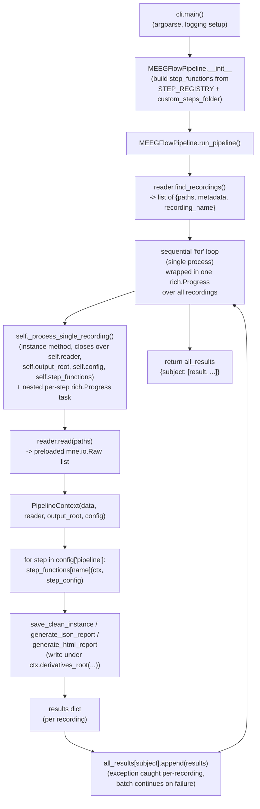
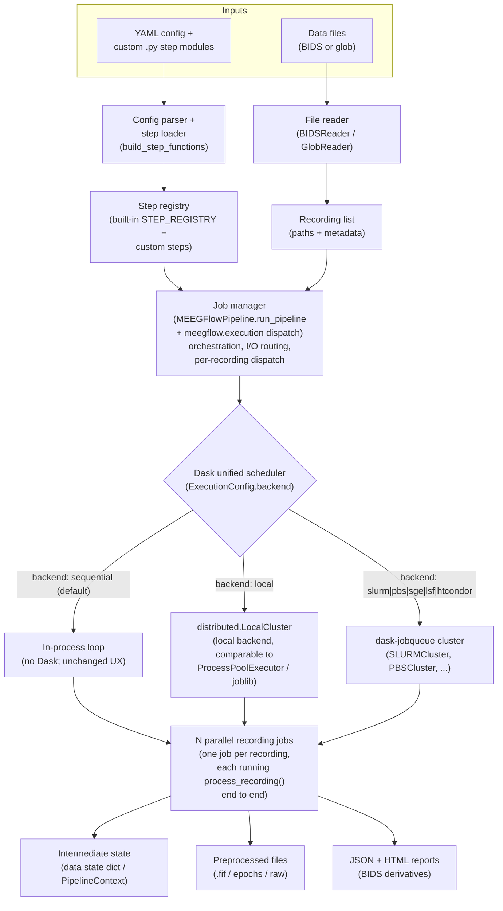

# Design: Parallel Recording Execution with Dask

**Status:** proposed → implemented (see "Implementation" commits on
`feature/dask-parallel-execution`)
**Author:** MEEGFlow dev agent
**Date:** 2026-07-03

## 1. Problem statement

`MEEGFlowPipeline.run_pipeline` currently processes recordings strictly
sequentially, in a single Python process, one at a time. For datasets with
many subjects/sessions this leaves most of a workstation's cores (or an
entire HPC allocation) idle. The goal is to parallelize execution — one full
pipeline run per recording — using Dask, while keeping today's single-process
behavior as the default so existing users/configs/tests are unaffected.

This matches the target architecture in `meegflow_architecture_final.svg`:
a **job manager** dispatches one job per recording through a **Dask unified
scheduler**, either a **local backend** or **dask-jobqueue** (Slurm/PBS/SGE/
LSF/Condor), producing the same per-recording outputs (data state dict,
preprocessed files, JSON+HTML reports) as today.

## 2. Current architecture



Key properties of the current design:
- Exactly one Python process handles the whole batch; recordings are
  processed strictly one after another.
- `_process_single_recording` is a **bound instance method** — it reads
  `self.reader`, `self.output_root`, `self.config`, `self.step_functions`
  directly. It is not designed to be shipped anywhere; it only ever runs in
  the calling process.
- Custom steps are loaded once, in `__init__`, via `importlib.util` from
  `.py` files named in `config['custom_steps_folder']`, and stored as
  entries of `self.step_functions` (plain function objects living in
  dynamically created, non-installed modules registered under
  `sys.modules[f"custom_steps.{stem}"]`).
- Progress is reported via two nested `rich.Progress` bars: one for
  "recordings processed / total", one for "steps executed / total" *within*
  the currently-running recording. Both live-update in the same terminal
  because everything happens in one process/thread.
- One recording's exception is caught in `run_pipeline`'s loop and stored as
  `{'error': str(exc)}` in `all_results`; the batch continues.
- Output paths are computed from `ctx.derivatives_root(subdir)`, which is
  itself a `BIDSPath`-scoped directory keyed by
  `subject/session/task/acquisition` (see `steps/output.py`). Since
  `reader.find_recordings()` already returns one entry per unique
  `(subject, session, task, acquisition)` combination, two recordings never
  write to the same output path — **this holds today and continues to hold
  under parallel execution**, so no new locking/coordination is needed for
  writes.

## 3. Target architecture



Key differences from the current design:
- The **job manager** (`run_pipeline` + `meegflow.execution`) is
  Dask-backend-agnostic: it builds the recording list and dispatches once
  per recording regardless of backend.
- The **unit of work** dispatched per recording is a **module-level,
  picklable function** (`meegflow.pipeline.process_recording`), not a bound
  method. It receives everything it needs as plain arguments (`reader`,
  `output_root`, `config`, `step_functions`, `paths`, `metadata`,
  `io_backend`) rather than closing over `self`.
- Each **job independently rebuilds its own step registry**
  (`build_step_functions(config)`) from `STEP_REGISTRY` (repopulated simply
  by importing `meegflow.steps`) plus any `custom_steps_folder` — see §4.3
  for why this is safer than trying to pickle already-loaded custom step
  functions across process/host boundaries.
- Progress reporting no longer assumes a single shared terminal/process —
  see §4.5.

## 4. Concrete change list

### 4.1 New module: `src/meegflow/execution.py`

Houses the scheduling abstraction — everything Dask-specific lives here, so
`pipeline.py` and `steps/` never need to import `dask` directly.

- `ExecutionConfig` (dataclass): `backend: str = "sequential"`,
  `n_workers: int = 1`, `cluster_kwargs: dict = {}`.
  `ExecutionConfig.from_config(config)` parses the new `execution:` block of
  the YAML pipeline config (see §4.4).
- `run_sequential(recordings, reader, output_root, config, step_functions,
  io_backend)` — today's single-process loop, moved here essentially
  unchanged (same `rich.Progress` bar over recordings, same
  per-recording `try/except` isolation). This is what runs when
  `backend == "sequential"` (the default), so **default behavior and its
  output shape are unchanged**.
- `run_dask(recordings, reader, output_root, config, io_backend,
  exec_config)` — shared code path for both the `local` backend and every
  `dask-jobqueue` backend:
  - Builds a `distributed.LocalCluster` (backend `local`) or the matching
    `dask_jobqueue.<X>Cluster` (backend `slurm`/`pbs`/`sge`/`lsf`/
    `htcondor`), passing `cluster_kwargs` straight through to the
    constructor and scaling to `n_workers`.
  - Connects one `distributed.Client` to that cluster and calls
    `client.submit(_run_recording_job, ...)` once per recording — one Dask
    task == one full pipeline run for one recording, matching "N parallel
    recording jobs, one job per recording, each running the full pipeline"
    from the target architecture.
  - Gathers results with `distributed.as_completed`, so **one recording's
    exception (raised inside the worker and re-raised by `future.result()`)
    is caught per-future** exactly like the sequential path's `try/except`
    — the batch is not aborted, and the failing recording's entry becomes
    `{'error': str(exc)}`, preserving today's `all_results` contract.
  - Logs one line per completed/failed recording
    (`[n/N] Completed <recording_name>` / `[n/N] Error processing
    <recording_name>: ...`) — see §4.5.
  - `dask`/`distributed`/`dask_jobqueue` are imported **lazily inside these
    functions**, not at module import time, so importing `meegflow.execution`
    (and therefore `meegflow.pipeline`) never requires Dask to be installed
    unless a non-sequential backend is actually requested.
- `_run_recording_job(reader, output_root, config, paths, metadata,
  io_backend)` — the module-level, picklable function actually submitted to
  Dask. It locally imports `build_step_functions` and `process_recording`
  from `meegflow.pipeline` (to avoid a module-level circular import between
  `pipeline.py` and `execution.py`) and calls
  `process_recording(reader=reader, output_root=output_root, config=config,
  step_functions=build_step_functions(config), paths=paths,
  metadata=metadata, io_backend=io_backend)`.

### 4.2 `src/meegflow/pipeline.py`

- **New module-level function `process_recording(reader, output_root,
  config, step_functions, paths, metadata, io_backend='read_raw_bids')`** —
  the former body of `_process_single_recording`, minus the `self`/
  `progress`/`task_id` parameters. This is the actual "run the full pipeline
  for one recording" unit of work, and the only thing that needs to be
  importable/picklable for `dask-jobqueue` to ship it to a remote worker
  process on a completely different host (functions defined as bound
  methods of an object that itself holds a live `reader` won't reliably
  survive that trip; a plain function taking simple, picklable arguments
  will).
- **New module-level function `build_step_functions(config) ->
  Dict[str, Callable]`** — combines `STEP_REGISTRY` with any
  `custom_steps_folder` steps. `MEEGFlowPipeline.__init__` now calls this
  instead of duplicating the "start from STEP_REGISTRY, then update with
  custom steps" logic inline. Internally it reuses
  `MEEGFlowPipeline._load_custom_steps` (which never actually reads `self`)
  so the custom-step-loading implementation exists in exactly one place.
- **Removed**: the instance method `_process_single_recording` and the
  helper `_get_pipeline_steps` (its one call site moved into
  `process_recording`, which now validates `config['pipeline']` inline).
- `MEEGFlowPipeline.run_pipeline` becomes a thin job manager: find
  recordings via the reader, parse `ExecutionConfig` from `self.config`, and
  delegate to `execution.run_sequential` or `execution.run_dask` — no
  backend-specific logic lives in `pipeline.py` itself.
- `MEEGFlowPipeline.run_step` and `_load_custom_steps` are **unchanged**.

### 4.3 Custom steps reaching worker processes

Custom step functions are loaded via `importlib.util.spec_from_file_location`
into a dynamically-created module registered as
`sys.modules[f"custom_steps.{stem}"]`. That module only exists in whichever
process ran `_load_custom_steps` — it is **not** on disk as an installed
package, so:
- Standard `pickle` cannot serialize such a function *by reference*
  (there's nothing importable on the receiving end to resolve
  `custom_steps.my_module.my_func` against) — this matters most for
  `dask-jobqueue`, where workers are separate OS processes on (often)
  different machines entirely, with no shared `sys.modules` state.
- `cloudpickle` (Dask's default serializer) *can* often serialize such
  functions **by value** (shipping the bytecode/closure), which covers the
  `local` backend (same filesystem, typically same host) reasonably well —
  but relying on that is fragile and version-sensitive, and doesn't help at
  all if the custom steps folder isn't present on the worker's filesystem
  for any file-based side effects the custom step might have (e.g. reading
  a bundled data file relative to its own location).

**Decision implemented:** rather than trying to serialize already-loaded
custom step *function objects* across the wire, each worker independently
calls `build_step_functions(config)` — i.e. it **re-runs
`_load_custom_steps(config['custom_steps_folder'])` itself**, from its own
filesystem. `config` (a plain dict of YAML-loaded values, including the
`custom_steps_folder` *path string*) is trivially picklable. This means:
- For the `local` backend, the custom steps folder just needs to exist on
  the same machine (true by construction — `LocalCluster` workers are local
  processes).
- For `dask-jobqueue` backends, **the custom steps folder must be on a
  filesystem shared with (or otherwise reachable from) the compute nodes**
  — the same requirement HPC users already have for the BIDS dataset itself.
  This is called out in the docs (§ "Custom steps on a cluster") rather than
  silently assumed.

### 4.4 New config surface

A new, optional, top-level `execution:` block in the YAML config (parsed by
`ExecutionConfig.from_config`), analogous to the existing
`custom_steps_folder` top-level key:

```yaml
execution:
  backend: local          # sequential (default) | local | slurm | pbs | sge | lsf | htcondor
  n_workers: 4
  cluster_kwargs:          # forwarded verbatim to the underlying Dask/dask-jobqueue constructor
    queue: normal
    cores: 4
    memory: 16GB
    walltime: "02:00:00"
```

If `execution` is omitted entirely, behavior is 100% identical to today
(`backend: sequential`, single process, same `rich.Progress` UX).

**No new CLI flags were added.** `custom_steps_folder` — the closest
existing precedent for "infrastructure, not per-run filter" configuration —
is YAML-only, not exposed as a CLI flag either, and `cluster_kwargs` is an
open-ended nested mapping that maps far more naturally to YAML than to
`argparse` flags. This is flagged explicitly as a judgment call in §5 in
case a human reviewer prefers `--execution-backend` / `--n-workers` CLI
overrides for convenience.

### 4.5 Progress reporting

- **`sequential` backend (default):** unchanged — single `rich.Progress` bar
  over "recordings processed / total". The previous *nested* per-step
  progress bar (steps within the current recording) was **removed**: it
  existed only because `_process_single_recording` accepted a
  `progress`/`task_id` pair to update a second, per-step task, and that
  coupling is exactly what stood in the way of making the per-recording unit
  of work a plain, picklable function. Per-step detail is still available at
  `logger.info("Executing step: ...")` granularity (unchanged). This
  simplification is called out explicitly in §5 as a UX trade-off a human
  should sign off on.
- **`local` / `dask-jobqueue` backends:** a live, nested, in-place-updating
  progress bar cannot meaningfully represent state that's actually changing
  inside other OS processes (or other machines, for `dask-jobqueue`).
  Instead, `run_dask` logs one line per submission and one line per
  completed/failed recording, with a running `[n/N]` counter, via the
  existing MNE logger (`logger.info` / `logger.error`) — consistent with
  the project's existing logging conventions and with `--log-file`. Dask's
  own dashboard link (`client.dashboard_link`) is also logged once, for
  users who want the richer live view Dask itself provides.

### 4.6 `setup.py`

`dask`/`dask-jobqueue` are added as `extras_require`, **not** as hard
`install_requires`, so users who only need sequential execution (today's
only mode, still the default) are not forced to install Dask:

```python
extras_require={
    "dask": ["dask[distributed]>=2024.1.0"],
    "dask-jobqueue": ["dask[distributed]>=2024.1.0", "dask-jobqueue>=0.8.2"],
},
```

`pip install meegflow[dask]` covers the `local` backend;
`pip install meegflow[dask-jobqueue]` covers Slurm/PBS/SGE/LSF/HTCondor.
Requesting a non-sequential backend without the corresponding extra raises a
clear `ImportError` at cluster-construction time (not at `import meegflow`
time), naming the exact `pip install` command to run.

### 4.7 Failure isolation preserved

Both `run_sequential` and `run_dask` preserve "one recording's failure does
not abort the batch": the sequential path already wraps each iteration in
`try/except`; the Dask path wraps each `future.result()` call (which
re-raises whatever exception happened inside the worker) in the same
`try/except`, inside the `as_completed` loop, so a `distributed.Future`
raising doesn't stop iteration over the remaining futures.

## 5. Things that need review before implementing

These are judgment calls made in this design that a human reviewer should
explicitly confirm or override before the branch is merged/pushed:

1. **Default stays sequential, opt-in for parallel.** Implemented as
   described. Confirm this is the desired default (vs., e.g., auto-detecting
   available cores and defaulting to `local` with some worker count).
2. **`dask`/`dask-jobqueue` as optional extras, not hard dependencies.**
   Implemented as described. Confirm the extras split (`dask` vs.
   `dask-jobqueue`) matches how you expect users to install this — an
   alternative would be a single `meegflow[parallel]` extra bundling both.
3. **Per-step progress bar removed for the sequential path.** Kept the
   top-level "recordings processed / total" bar, dropped the nested
   per-step bar. Confirm this simplification is acceptable, or whether the
   per-step bar should be preserved for the sequential backend specifically
   (which *could* keep it, since it never has to cross a process boundary —
   at the cost of `process_recording` needing an optional callback
   parameter and slightly more coupling between "run the pipeline" and
   "report progress").
4. **No CLI flags for backend/n_workers/cluster_kwargs — YAML-only.**
   Confirm, or request `--execution-backend`/`--n-workers` CLI overrides
   layered on top of the YAML config (CLI would need to win over YAML if
   both given).
5. **Per-worker memory footprint / worker count is entirely user-specified**
   (`n_workers` in the config), with no automatic capping based on available
   RAM or recording size. EEG/MEG recordings preloaded into memory can be
   large; running `n_workers` of them concurrently multiplies peak memory
   use roughly by `n_workers`. This design does not add any automatic
   guard rail (e.g. capping `n_workers` by `os.cpu_count()` or available
   RAM) — confirm whether that's in scope now or an explicit follow-up, and
   whether docs alone (recommend starting conservative, watch memory) are
   sufficient for v1.
6. **Cluster-specific parameters (`queue`, `cores`, `memory`, `walltime`,
   etc.) are passed through `cluster_kwargs` unvalidated** — MEEGFlow does
   not validate that the caller supplied the parameters a given
   `dask_jobqueue.<X>Cluster` actually requires; any error surfaces as
   whatever `dask-jobqueue` itself raises. Confirm this "thin passthrough,
   no schema validation" scope is acceptable for v1, or whether
   per-scheduler required-field validation is wanted (documented here as a
   deliberately deferred future extension either way).
7. **Custom steps + `dask-jobqueue` require a shared/reachable filesystem**
   for `custom_steps_folder` across the scheduler and all compute nodes
   (§4.3). This is a real operational constraint for HPC users, documented
   but not otherwise enforced or checked at submission time.
8. **No real HPC cluster was available to test against** in this
   environment. `SLURMCluster`/etc. construction is covered by unit tests
   that mock `dask_jobqueue`, and the `local` backend is exercised against
   a real (small) `distributed.LocalCluster`, but the `dask-jobqueue` code
   path has not been run against an actual Slurm/PBS/SGE/LSF/HTCondor
   scheduler. Flagged as a follow-up for whoever has access to such a
   cluster.
